# GKrellM Dock for NVIDIA DGX Spark (GB10)

**Repository:** [github.com/pchmielewski1/gkrellm-dock](https://github.com/pchmielewski1/gkrellm-dock)

A specialized [GKrellM](http://gkrellm.srcbox.net/) system-monitor dock for **NVIDIA DGX Spark** machines based on the **GB10** Grace Blackwell Superchip (FE and OEM).

It provides a ready-made set of **GKrellM plugins** plus the **`gb10-blue`** theme that turn GKrellM into a slim right-edge system monitor showing the metrics that matter on this platform: Grace CPU clusters, unified memory, board thermals, NVIDIA GPU telemetry, Docker/network activity, and an optional live LLM panel (NIM/vLLM or SGLang).

<p align="center">
  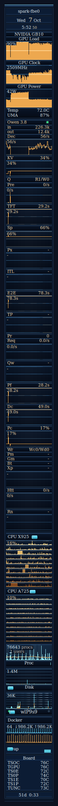
</p>

<p align="center">
  <em>Theme <code>gb10-blue</code> · right edge · ~128 px wide · live on Spark</em>
</p>

---

## Who this is for

- DGX Spark GB10 users (Founders Edition or OEM) running **Ubuntu + GNOME on Xorg**
- Anyone who wants a ready-made, opinionated dock instead of configuring stock GKrellM by hand
- Operators running local **vLLM**, **NIM**, or **SGLang** servers who want decode/prefill token rates next to GPU load

---

## Features

| Area | What you get |
|------|----------------|
| **GPU** | NVML Load %, Clock (**2400–2550 MHz** chart window), Power W, Temp + UMA % |
| **LLM NIM** | Live **vLLM/NIM**, **SGLang** or **TensorFold** Prometheus panel — auto-detect backend, 27 toggleable metrics, engine lamp, session **`in`**/**`out`** tokens, up to **4** scrape slots |
| **CPU** | Separate charts for Cortex-**X925** and Cortex-**A725** (not a single composite) |
| **Memory** | **UMA %** in the GPU block (unified memory); stock **Swap** meter; the separate `uma_dram.so` panel is optional (off by default) |
| **Board** | 7 ACPI thermal zones: TSOC, TGPU, TS0E, TS0P, TS1E, TS1P, TUNC |
| **Disk** | Composite Disk chart, fixed **200 MB/s** full scale |
| **Net** | `docker0` + physical NICs (stock, shown while up); every UP container **veth** folded into one `net_clusters` chart; PPP/bridge noise ignored |
| **Theme** | `gb10-blue` — dark navy / cyan dock skin |
| **Config** | Managed `~/.gkrellm2` config via one installer script (`scripts/install.sh`) |

---

## Quick start (clone → installed dock)

On a DGX Spark desktop session:

```bash
git clone https://github.com/pchmielewski1/gkrellm-dock.git
cd gkrellm-dock
./scripts/install.sh
```

Options:

| Option | Effect |
|--------|--------|
| `--skip-deps` | Do not apt-install missing packages |
| `-h`, `--help` | Show help |

That single `./scripts/install.sh`:

1. Installs build/runtime packages via `apt` if missing (`gkrellm`, `libgtk2.0-dev`, `libcurl4-openssl-dev`, `pkg-config`, `build-essential`)
2. Builds all six plugins (`make plugins`)
3. Installs the plugins to `~/.gkrellm2/plugins/` and the theme to `~/.gkrellm2/themes/gb10-blue/`
4. Writes the managed `~/.gkrellm2/user-config` + `plugin_enable` via `scripts/install_config.sh`

Then start the dock:

```bash
gkrellm -t ~/.gkrellm2/themes/gb10-blue
```

Verify it loaded the plugins: right-click the dock → **Plugins** — you should see **nvidia**, **LLM NIM**, **cpu_clusters**, **net_clusters** and **board_acpi** entries, and the dock should show the GPU, NIM, CPU-cluster, folded Docker net and Board panels (screenshot gallery below).

> **Not included:** the auto-launch/autostart script for GKrellM is intentionally **not** part of this project. Launching `gkrellm` at login, and pinning the window to the right edge, are handled by your host environment (e.g. a small GNOME autostart entry running `gkrellm -t ~/.gkrellm2/themes/gb10-blue -g +X+Y`).

---

## Requirements

| Component | Notes |
|-----------|--------|
| Hardware | NVIDIA DGX Spark, **GB10** (aarch64). Works on any GB10 host; on other aarch64 hosts the GPU/board panels may degrade (no NVML / no GB10 ACPI thermal zones) |
| OS | Ubuntu 24.04-class, **X11** session — check with `echo $XDG_SESSION_TYPE` → `x11` |
| Display | GNOME or compatible; default display often `:1` under GDM |
| Packages | `gkrellm`, `libgtk2.0-dev`, `libcurl4-openssl-dev`, `pkg-config`, `build-essential` (installed automatically) |
| GPU libs | `libnvidia-ml.so.1` (NVML; shipped with the NVIDIA driver) |
| Optional | Docker + vLLM/NIM or SGLang on `http://127.0.0.1:8000` for the LLM panel (SGLang needs `--enable-metrics`) |

Wayland-only sessions are **not** supported by window-placement tooling (GKrellM itself runs, but auto-pinning uses X11 tools).

---

## Dock layout (top → bottom)

Typical order after a fresh install (plugin load order `nvidia → llm_nim → cpu_clusters → net_clusters → board_acpi`):

1. Hostname / clock
2. **GPU** — Load, Clock, Power, Temp + UMA % (`nvidia.so`)
3. **LLM / NIM** — header + engine lamp + session **`in`**/**`out`** token totals + one strip per enabled Display bit (`llm_nim.so`)
4. **CPU X925** / **CPU A725** (`cpu_clusters.so`)
5. Proc / Disk (stock)
6. **Net** — `docker0`, Wi‑Fi/Ethernet (stock) + one folded **Docker** chart for all container `veth*` (`net_clusters.so`)
7. Swap + **Board** + Uptime (unified-memory % is the **UMA %** chart in the GPU block; the separate `uma_dram.so` panel is built but not enabled by default — it duplicated that chart)

### Screenshot gallery

Every screenshot is a live capture from a running dock; the full catalog and re-capture instructions are in [docs/SCREENSHOTS.md](docs/SCREENSHOTS.md).

| Region | What you see | Screenshot |
|--------|----------------|------------|
| Hostname / clock | Host id, calendar date, clock | 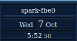 |
| GPU | GPU Load, Clock, Power, Temp + UMA % (`NVIDIA GB10` block) | 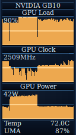 |
| GPU (zoom) | Closer view of the GPU charts | 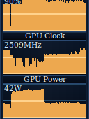 |
| LLM NIM | NIM header with model name + engine status lamp; session `in`/`out` token totals | 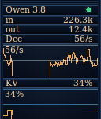 |
| LLM NIM (full) | The complete LLM NIM panel — all enabled Display strips + LINE charts | 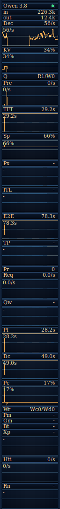 |
| CPU | Both Grace clusters — **CPU X925** and **CPU A725** (one mini-band per core) | 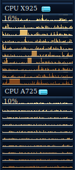 |
| CPU (X925) | Cortex-X925 cluster only | 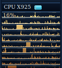 |
| CPU (A725) | Cortex-A725 cluster only | 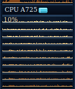 |
| Proc / users | Process/user counts and the Proc meter | 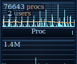 |
| Disk / Net | Disk chart + stock net meter(s) (Wi‑Fi/Ethernet, `docker0` while up) + the folded **Docker** chart (all UP container `veth*`: in = cyan top band, out = amber bottom band) | 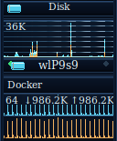 |
| Bottom | Swap, Board thermals (TSOC…TUNC), Uptime | 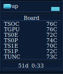 |

Vertical slices (top / middle / lower of the full dock):

| Top third | Middle | Lower |
|-----------|--------|-------|
| 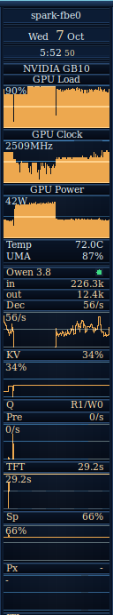 | 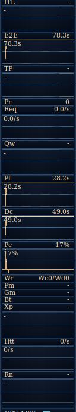 | 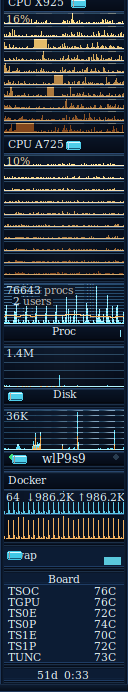 |

---

## Plugins and panels

Six plugins are built and installed by `scripts/install.sh` / `make install`:

| Plugin | Panel | Data source |
|--------|-------|-------------|
| `nvidia.so` | NVIDIA GB10: Load, Clock, Power, Temp, UMA % | libNVML (`libnvidia-ml.so.1`) + `/proc/meminfo` |
| `llm_nim.so` | NIM / vLLM / SGLang / TensorFold panel (header, lamp, `in`/`out`, 27 optional strips) | `GET {url}/metrics` (Prometheus), optional `GET {url}/v1/models` — **vLLM** `vllm:*` when present; **SGLang** via `sglang:gen_throughput`, `token_usage`, or `prompt_tokens_total` (requires `--enable-metrics`); **TensorFold** via any `tensorfold:` family (engine ≥ 0.6.1) plus live `GET {url}/health` for Dec/Pre token counters |
| `cpu_clusters.so` | CPU X925 / CPU A725 | `/proc/cpuinfo` + `/proc/stat` |
| `net_clusters.so` | Docker — one chart (in/out bands) for **all** `veth*` interfaces, any number of containers | `/proc/net/dev` (rescanned every second) |
| `uma_dram.so` | DRAM UMA (built/installed, **not enabled** by default — duplicates the GPU block's UMA %) | `/proc/meminfo` |
| `board_acpi.so` | Board: TSOC, TGPU, TS0E, TS0P, TS1E, TS1P, TUNC | `/sys/class/thermal/` |

Per-plugin deep reference — scales, units, settings UI, config keys: [docs/PLUGINS.md](docs/PLUGINS.md) and [docs/PLUGINS_CLI.md](docs/PLUGINS_CLI.md).

### LLM NIM plugin (`llm_nim`)

Scrapes a local OpenAI-compatible inference server (reference: Docker NIM/vLLM or SGLang on `http://127.0.0.1:8000`).

- **Backend auto-detect:** vLLM/NIM when `/metrics` exposes `vllm:*`; SGLang when it exposes `sglang:gen_throughput`, `sglang:token_usage`, or `sglang:prompt_tokens_total` (requires **`--enable-metrics`**); **TensorFold** when it exposes any `tensorfold:` family (MiaAI Flash-Next TensorFold recipe ≥ 0.6.1). Full field mapping: [docs/LLM_NIM_UI.md](docs/LLM_NIM_UI.md#metrics-backends).
- **Engine lamp** on the header row (right): green = awake, yellow = weights offloaded, red = discard_all, gray = down/unknown (vLLM sleep states; SGLang forces awake when metrics are live). Toggle via Display → **Engine status lamp**.
- **Session token totals** (always on, not a Display checkbox) — two strips under the model name:
  - **`in`** — Prefill / prompt tokens since **this GKrellM dock process** started (sum of each scrape’s Δ prompt-token counter)
  - **`out`** — Decode / generation tokens since dock start (sum of Δ generation-token counter)
  - Format `k` / `M` / `B`. Zeroed when the GKrellM process restarts. NIM often lands prefill as **one jump** when prefill is accounted — `in` grows by that full Δ in one tick.
- **Settings:** GKrellM → **Plugins → LLM NIM** — a notebook with 7 tabs: **Connection** (URL, display name, tokens, docs pin, air-gap), **Catalog**, **Local**, **Recipes**, **Instances**, **Options** (chart scales, timeout) and **Display** (27 checkboxes; toggling adds/removes a dock strip immediately). **Every tab, field and button, with its exact behaviour, is documented in [docs/LLM_NIM_UI.md](docs/LLM_NIM_UI.md).** The Catalog/Local/Recipes/Instances tabs drive the optional `gkrellm-nim` helper (a separate NIM lifecycle project); without it they report *helper missing* and the panel still works for monitoring.
- **Dock strip:** tag left | value right; non-text metrics also get a **LINE** chart (history scrolls horizontally in time, amplitude = value).
- **Multi-slot:** up to 4 scrape targets. Slot 0 is the full panel (`llm_nim url`); slots 1–3 (`slotN_url` / `slotN_name`) add a compact header + lamp + one-line summary.

<details>
<summary><b>Display options (dock tag → meaning) — click to expand</b></summary>

Metric names below are the **vLLM** Prometheus sources. On **SGLang**, the plugin maps equivalent `sglang:*` gauges and histograms — see [Metrics backends](docs/LLM_NIM_UI.md#metrics-backends). Strips **Dc**, **Rn**, **Bt**, and **Xp** stay empty on SGLang (no server metric).

| Tag | Settings label | What it shows | Chart? |
|-----|----------------|---------------|--------|
| **Dec** | Decode t/s chart (TX) | Generation tokens / s (`vllm:generation_tokens_total` Δ/Δt) | yes |
| **KV** | KV cache % | KV-cache fill 0–100% (`vllm:kv_cache_usage_perc`) | yes |
| **Q** | Queue R/W | Running / waiting requests (`R…/W…`) | text |
| **Pre** | Prefill t/s chart (RX) | Prompt/prefill tokens / s (`vllm:prompt_tokens_total` Δ/Δt; often one spike when prefill lands) | yes |
| **TFT** | TTFT | Time to first token (histogram window mean) | yes |
| **Sp** | Spec-decode accept % | Accepted / draft speculative tokens % | yes |
| **Px** | Prefix cache hit % | Prefix-cache hits / queries % | yes |
| **ITL** | ITL | Inter-token latency (histogram window mean) | yes |
| **E2E** | E2E request latency | End-to-end request latency (histogram window mean) | yes |
| **TP** | TPOT | Time per output token (histogram window mean) | yes |
| **Pr** | Preemptions (total) | Cumulative engine preemptions | text |
| **Req** | Successful request rate | Finished OK requests / s | yes |
| **RSS** | Process RSS | Resident RAM of the metrics process (GiB) — not full container / UMA | text |
| **Qw** | Queue wait time | Time spent waiting in queue (histogram window mean) | yes |
| **Pf** | Prefill phase time | Prefill-phase duration (histogram window mean) | yes |
| **Dc** | Decode phase time | Decode-phase duration (histogram window mean) | yes |
| **Pc** | Prompt tokens cached % | Cached prompt tokens / prompt tokens % | yes |
| **5xx** | HTTP 5xx % | Share of HTTP 5xx among `http_requests_total` | yes |
| **CPU** | Process CPU % | CPU % of the metrics process (normalized by online cores) | yes |
| **Wr** | Wait by reason (Wc/Wd) | Waiting: capacity vs deferred (`Wc…/Wd…`) | text |
| **Eng** | Engine status lamp (header) | Header ● from `engine_sleep_state` (no dock tile) | lamp |
| **Pm** | Mean prompt tokens | Mean prompt size per request (histogram window) | text |
| **Gm** | Mean generation tokens | Mean generation size per request (histogram window) | text |
| **Bt** | Tokens per engine step | Mean tokens per engine iteration (histogram window) | text |
| **Xp** | External prefix hit % | Cross-instance / external prefix cache hit % | yes |
| **Htt** | HTTP request rate | All HTTP requests / s | yes |
| **Rn** | Inference phase time | Running/inference-phase duration (histogram window mean) | yes |

Offline / failed scrape: values show `down` or `-`; charts stay flat. Depends on **libcurl**.
</details>

---

## Configuration notes

- **`scripts/install_config.sh` owns** dock layout in `~/.gkrellm2/user-config` and `plugin_enable` (plugin load order, CPU off, net enables, theme, disk scale, …). Re-run it any time after editing the GKrellM GUI:

  ```bash
  ./scripts/install_config.sh
  ```

  LLM NIM preferences (`url`, `display_name`, `docs_release`, `airgap`, `features`, chart scales, timeout, slots) are **preserved** across re-apply when already set.
- **Stock composite CPU** and **stock Mem meter** are disabled on purpose (cluster charts replace the CPU; the GPU block's **UMA %** replaces the Mem meter).
- **Prefill / GPU clock scales** and the **net_clusters** pattern are written by `install_config.sh` — see [docs/PLUGINS_CLI.md](docs/PLUGINS_CLI.md) (managed `user-config` key table) and [docs/PLUGINS.md](docs/PLUGINS.md).
- Container **veth** names change on recreate — `net_clusters` rescans `/proc/net/dev` every second, so no restart or `install_config.sh` re-run is needed.

---

## Development

```bash
make            # build all 5 plugins (alias of make plugins)
make unit       # build test lib + run tests/test_cpu_map.py
make test       # build plugins (full check)
make clean      # remove build artifacts
```

Unit tests: `python3 tests/test_cpu_map.py` (run by `make unit`) — parses the GB10 `cpuinfo` fixture and verifies X925/A725 core mapping.

Screenshots are regenerated from a live dock with `./scripts/capture_screenshots.sh` (requires `DISPLAY`, `xwininfo`, PyGObject, Pillow) — see [docs/SCREENSHOTS.md](docs/SCREENSHOTS.md). Theme assets can be regenerated with `scripts/gen_theme.py`.

---

## Documentation

| Document | Contents / when to open it |
|----------|------------------------------|
| [docs/SCREENSHOTS.md](docs/SCREENSHOTS.md) | Screenshot catalog + how to re-capture — before comparing or regenerating any `docs/*.png` |
| [docs/PLUGINS.md](docs/PLUGINS.md) | Per-plugin deep reference: sources, scales, feature bitmask — when tuning a specific panel or metric |
| [docs/PLUGINS_CLI.md](docs/PLUGINS_CLI.md) | Panels + every managed `user-config` key + on-disk locations — when looking up a config key |
| [docs/LLM_NIM_UI.md](docs/LLM_NIM_UI.md) | LLM NIM settings: every tab, field, button + the dock panel anatomy — when configuring the NIM panel in the GUI |
| [docs/CONFIGURE.md](docs/CONFIGURE.md) | Configure → Plugins screenshots + every field/button at a glance |
| [docs/THEME.md](docs/THEME.md) | `gb10-blue` conventions and assets — when modifying or extending the theme |
| [docs/SENSORS.md](docs/SENSORS.md) | Board thermal zones (TSOC…TUNC) explained — when reading the Board panel or chasing thermals |

---

## Project layout

```text
gkrellm-dock/
├── plugins/
│   ├── nvidia/                 # GPU NVML charts (based on gkrellm-nvidia, GPL-2.0)
│   ├── llm_nim/                # NIM/vLLM/SGLang Prometheus scrape panel
│   ├── cpu_clusters/           # X925 / A725 cluster charts
│   ├── net_clusters/           # all container veth* folded into one chart
│   ├── uma_dram/               # Optional DRAM UMA readout (built, not enabled by default)
│   └── board_acpi/             # Board ACPI thermal zones
├── lib/
│   ├── cpu_map                 # /proc/cpuinfo → X925/A725 core lists
│   ├── cpu_stat                # /proc/stat busy/idle aggregation
│   └── thermal_map             # Thermal zone → board label mapping
├── themes/gb10-blue/           # Dock theme (gkrellmrc + assets)
├── scripts/
│   ├── install.sh              # All-in-one installer (deps, build, install)
│   ├── install_config.sh       # Managed ~/.gkrellm2 user-config
│   ├── capture_screenshots.sh  # Regenerate docs/*.png
│   └── gen_theme.py            # Generate theme assets
├── tests/                      # Unit tests + fixtures (make unit)
├── docs/                       # Manual + screenshots (see docs/SCREENSHOTS.md)
└── Makefile                    # Build / install / test entry points
```

---

## Credits

- GKrellM by Bill Wilson
- GPU plugin derived from [gkrellm-nvidia](https://github.com/carcass82/gkrellm-nvidia) (NVML, GPL-2.0+)
- DGX Spark / GB10 specialization, theme, cluster charts, UMA, Board, NIM panel, and installer: this project

---

## License

MIT — see [LICENSE](LICENSE). The `plugins/nvidia/` subtree stays under its original **GPL-2.0+** license (derived from gkrellm-nvidia); see `plugins/nvidia/COPYING` and `plugins/nvidia/README.md`.
