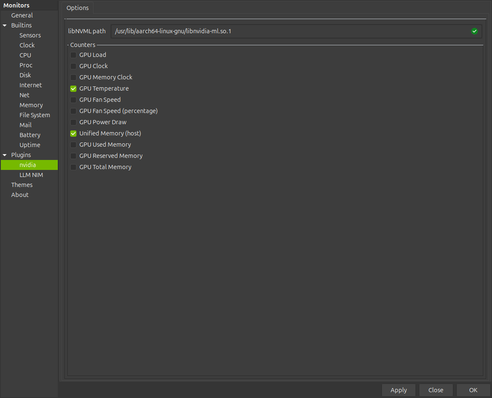

# Configure → Plugins reference

Visual guide to every **Configure → Plugins** screen in this project. Open via right-click the dock → **Configure**, or the GKrellM menu → **Configure**, then select a plugin in the left sidebar.

Plugins **without** a settings tab (`cpu_clusters`, `net_clusters`, `board_acpi` (and `uma_dram` if you enable it)) have fixed behaviour — see [PLUGINS.md](PLUGINS.md).

Screenshot catalog (including dock panels): [SCREENSHOTS.md](SCREENSHOTS.md).

---

## nvidia

| UI element | What it does |
|------------|--------------|
| **libNVML path** | Path to `libnvidia-ml.so.1`. Green ✓ = NVML loaded. Changed path re-inits NVML on **Apply** / **OK**. |
| **GPU Load** | Toggle Load % chart on the dock (0–100 %). |
| **GPU Clock** | Toggle clock chart (managed install uses 2400–2550 MHz window). |
| **GPU Memory Clock** | Text row — graphics memory clock MHz. |
| **GPU Temperature** | Temp °C in the text row under charts. |
| **GPU Fan Speed** | Text row — fan RPM. |
| **GPU Fan Speed (percentage)** | Text row — fan %. |
| **GPU Power Draw** | Power chart (W). |
| **Unified Memory (host)** | UMA % in the text row. |
| **GPU Used Memory** | Text row — VRAM/UMA used. |
| **GPU Reserved Memory** | Text row — reserved memory. |
| **GPU Total Memory** | Text row — total GPU memory. |

Drag rows to reorder strips. Checked rows + order are saved as `nvidia NVML <mask> <order> <path>` in `~/.gkrellm2/user-config`.

Deep reference: [PLUGINS_CLI.md](PLUGINS_CLI.md) · `nvidia.so`.

---

## LLM NIM

Full field-by-field reference with helper subcommands: **[LLM_NIM_UI.md](LLM_NIM_UI.md)**.

| Tab | Screenshot | Summary |
|-----|------------|---------|
| **Connection** | [configure-llm-connection.png](configure-llm-connection.png) | Scrape URL, header name, NGC/HF tokens, docs pin, air-gap. **Monitoring-only users** need only **Base URL** + **Display name** + **Refresh status**. |
| **Catalog** | [configure-llm-catalog.png](configure-llm-catalog.png) | Browse NGC NIM catalog, pull images. Requires `gkrellm-nim` helper + NGC token. |
| **Local** | [configure-llm-local.png](configure-llm-local.png) | Local Docker images, profile discovery, create recipe. |
| **Recipes** | [configure-llm-recipes.png](configure-llm-recipes.png) | Edit/start/export launch recipes (JSON). |
| **Instances** | [configure-llm-instances.png](configure-llm-instances.png) | Running containers, logs, dock slot wiring. |
| **Options** | [configure-llm-options.png](configure-llm-options.png) | Chart scales + HTTP scrape timeout. |
| **Display** | [configure-llm-display.png](configure-llm-display.png) | 27 checkboxes → dock metric strips (live toggle). |

### Connection — quick map

| Field / button | Purpose |
|----------------|---------|
| **Base URL** | Inference server root (`/metrics`, `/v1/models` appended). Default `http://127.0.0.1:8000`. |
| **Display name** | Dock header title (e.g. `Qwen 3.8`). Empty → auto from model name. |
| **Link:** | Read-only — URL → model id after **Refresh status**. |
| **NGC token** | For Catalog/Pull only. **Save tokens** stores under `~/.config/gkrellm-dock/`. |
| **HF token** | Optional — gated HuggingFace models only. |
| **Docs schema pin** | NIM docs version for **Catalog → Sync docs** (default `2.0.10`). |
| **Air-gap** | Offline mode — use vendored docs seed, no live fetch. |
| **Save tokens** | Persist NGC/HF keys. |
| **Test NGC login** | Validate stored NGC key. |
| **Refresh status** | Re-check tokens + live `/v1/models` for **Link:** line. |

### Catalog — quick map

| Field / button | Purpose |
|----------------|---------|
| **Last sync:** | Timestamp of last **Refresh** (NGC catalog sync). |
| List view | Cached NIM models from NGC. |
| **Model** / **Version** | Pick catalog entry → fills **Image ref**. |
| **Image ref** | Full `nvcr.io/nim/...` reference for Pull/Add. |
| **Refresh** | Sync NGC catalog into local cache + reload list. |
| **Add** | Add custom image ref to cache (not a docker pull). |
| **Sync docs** | Fetch/cache NIM environment-variable schema for **Docs schema pin**. Success dialog shows a short summary (not raw JSON). If live NVIDIA docs HTML cannot be parsed, helper falls back to vendored seed (`source: last_good`) — see [Known issues](#known-issues). |
| **Pull** | `docker pull` selected image → appears under **Local**. |

### Local — quick map

| Field / button | Purpose |
|----------------|---------|
| List view | Local NIM Docker images on this host. |
| **Local image** | Combo picker. |
| **Image ref** | Used by Profiles / Make recipe. |
| **Refresh** | Re-list local images. |
| **Profiles** | Run `list-model-profiles` inside image (~1–2 min). |
| **Make recipe** | Generate Spark-default recipe JSON → **Recipes** tab. |

### Recipes — quick map

| Field / button | Purpose |
|----------------|---------|
| **Recipe** | Select saved recipe name. |
| JSON editor | Recipe body (`image`, `env`, `args`, `host_port`, `profile`, …). |
| **Recipe name** | Name for Load/Save/Start/Export. |
| **Profile** / **Profile id** | NIM model profile for **Start**. |
| **Refresh** | Reload recipe names. |
| **Load** | Load JSON into editor. |
| **Save** | Write recipe file; merges Profile into `"profile"`. |
| **Load profiles** | Fill Profile combo from image. |
| **Start** | `docker run` from recipe (uses local image if present). |
| **Install Spark preset** | Add example `nemotron-nim` recipe only. |
| **Export preview** | Show `docker run` script (no secrets). |

### Instances — quick map

| Field / button | Purpose |
|----------------|---------|
| Log view | Helper output / live container logs. |
| **Instance** | Managed NIM instance selector. |
| **Adopt container name** | Import externally started container. |
| **Orphan name** | Reclaim orphan container. |
| **Refresh** | Reload instance list. |
| **Logs** | Tail + follow logs. |
| **Stop** / **Restart** / **Recreate** | Container lifecycle. |
| **Refresh state** | Update health/state column. |
| **Use on dock** | Point main LLM panel (slot 0) at instance URL. |
| **Add to dock** | Add compact slot 1–3. |
| **Clear extra slots** | Clear slots 1–3 only. |
| **Adopt** / **Orphans** / **Reclaim** | Orphan/adopt workflow. |

### Options — quick map

| Field | Purpose |
|-------|---------|
| **Decode chart max (t/s)** | Full scale of Dec (TX) chart. Default 50. |
| **Prefill chart max (t/s)** | Base scale of Pre (RX) chart (auto-grows on peaks). Default 1000. |
| **Scrape timeout (ms)** | HTTP timeout for `/metrics`. Default 500. |

### Display — quick map

27 checkboxes in four groups — each toggles a dock strip immediately. See [LLM_NIM_UI.md § Display tab](LLM_NIM_UI.md#display-tab) for bit values and Prometheus sources.

Session **`in`** / **`out`** token rows are always on (not in Display).

---

## Known issues

### Catalog → Sync docs

If live NVIDIA docs HTML cannot be parsed, `gkrellm-nim docs-sync` falls back to the vendored schema seed (`source: last_good`) and may set `sync_error: no NIM_* variables parsed from docs HTML`. That is not a hard failure — air-gap / offline Spark hosts still get a usable env-var schema. The plugin shows a short summary dialog (not raw JSON).

---

## Apply / Close / OK

All Configure dialogs share **Apply** (save without closing), **Close** (discard if not applied), **OK** (save and close). LLM NIM tabs apply live on change where noted in [LLM_NIM_UI.md](LLM_NIM_UI.md).
