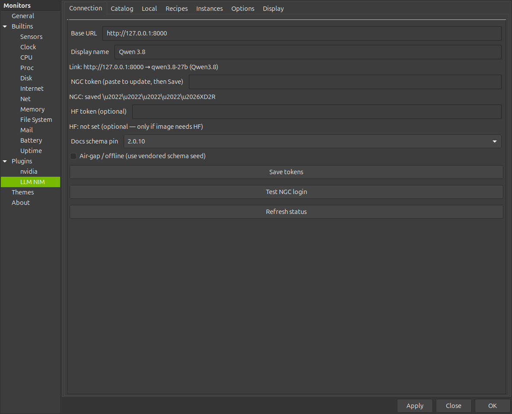
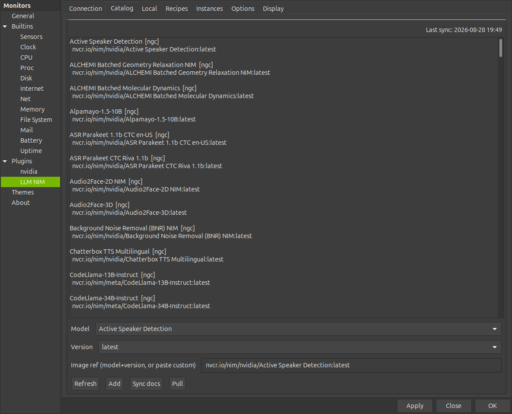
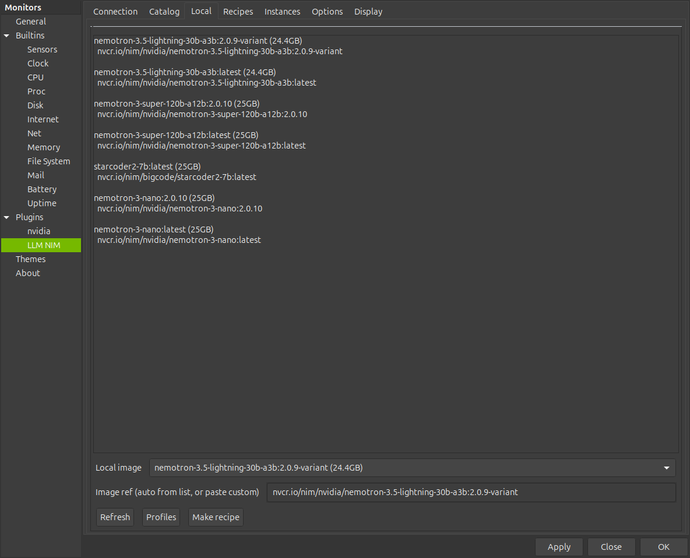
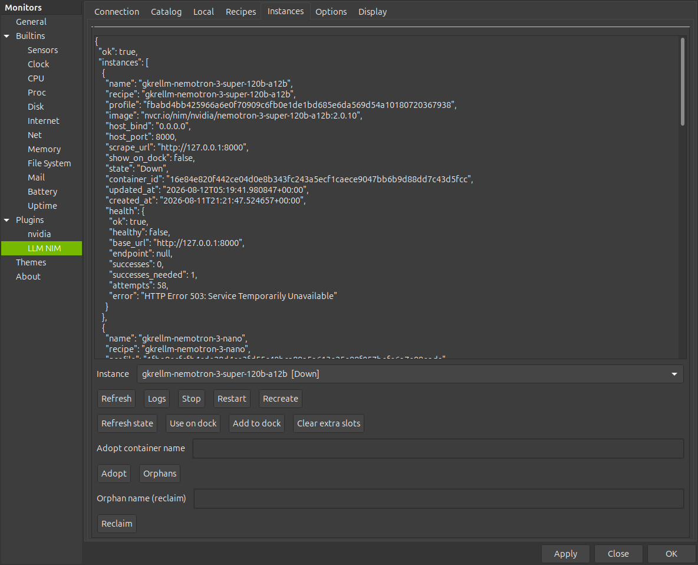
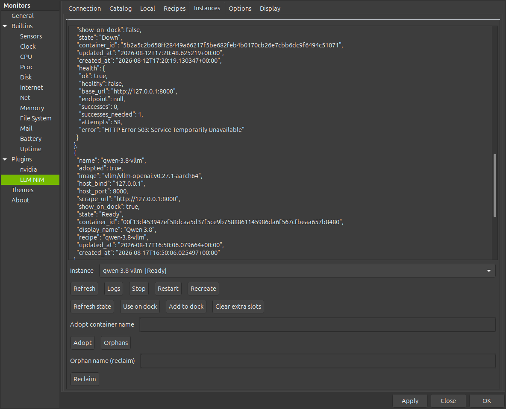
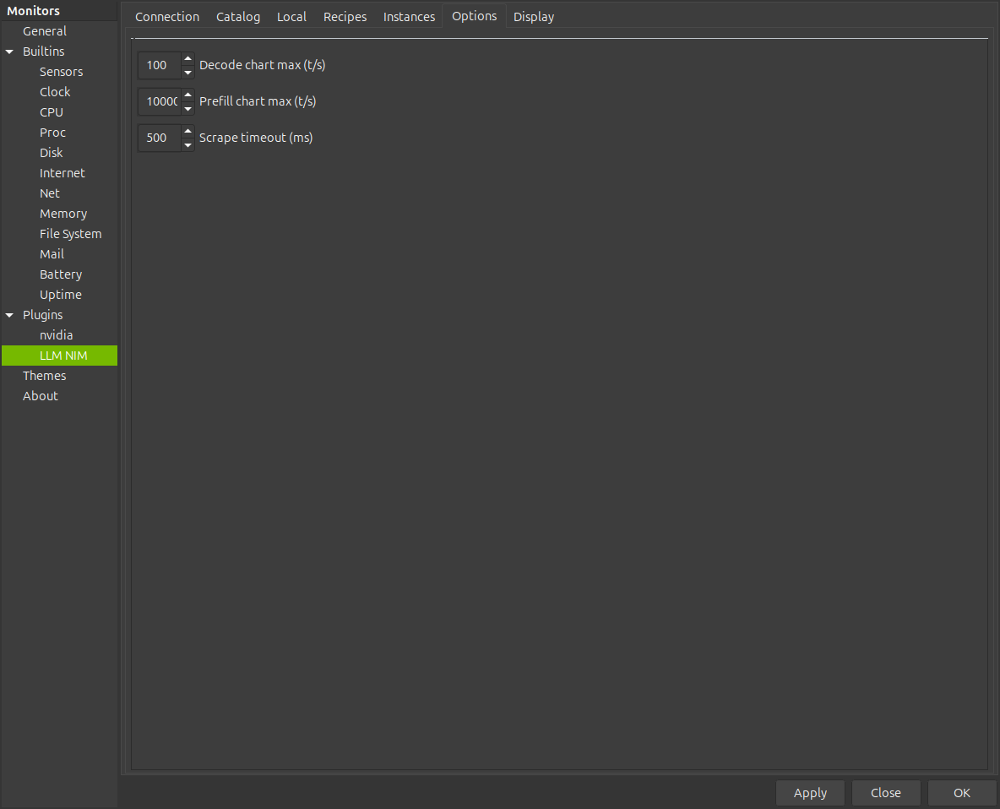
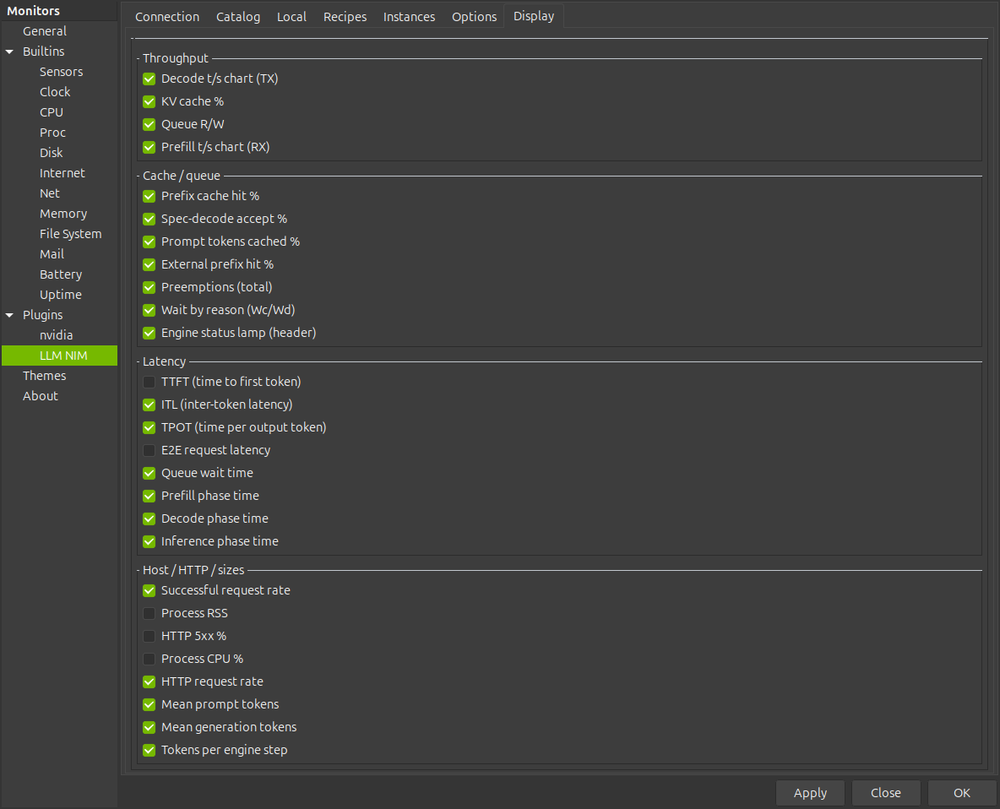

# LLM NIM — settings and dock panel reference

Exact reference for the **LLM NIM** settings dialog (GTK notebook in `plugins/llm_nim/llm_nim.c`) and the dock panel it drives. Open via the GKrellM right-click/toolbar menu → **Plugins → LLM NIM**; changes apply live and the dock rebuilds immediately.
The panel scrapes `GET {url}/metrics` (Prometheus text format) once per GKrellM second-tick, plus optionally `GET {url}/v1/models` for the header model name (also used by **Connection → Refresh status**).
Buttons on the **Catalog** / **Local** / **Recipes** / **Instances** / **Connection** (tokens) tabs shell out to the external `gkrellm-nim` helper (a separate project, found on PATH or `~/.local/bin`); each tab shows its result in a dialog or the tab's text view.

## Metrics backends

Primary: **vLLM** (and NIM containers, which run vLLM inside) — `vllm:*` counters and histograms, all feature strips populated.

Secondary: **SGLang** — auto-detected when `/metrics` contains `sglang:gen_throughput`, `sglang:token_usage`, or `sglang:prompt_tokens_total`. Requires `--enable-metrics` on the server. vLLM scrape path is unchanged; when SGLang is detected the plugin overlays `sglang:*` fields (histogram sums aggregate all label variants).

Tertiary: **TensorFold** — auto-detected when `/metrics` contains any `tensorfold:` family (MiaAI Flash-Next TensorFold recipe, engine ≥ 0.6.1). Metrics keep a `tensorfold:` prefix even on vLLM-shaped names. Detection order: SGLang → TensorFold → vLLM.

| Dock field | SGLang metric | Note |
|---|---|---|
| Dec (t/s) | `sglang:gen_throughput` | server gauge; idle ≈ 0 |
| Pre (t/s) | Δ `sglang:prompt_tokens_total` | summed over `is_streaming` labels |
| in / out session | Δ prompt / generation token totals | same counters |
| KV % | `sglang:token_usage` | 0–1 → percent |
| Queue R/W | `sglang:num_running_reqs` / `sglang:num_queue_reqs` | |
| Wr Wc/Wd | prefill vs decode queue depth gauges | bootstrap+inflight / prealloc+transfer |
| Prefix % | `sglang:cache_hit_rate` | instant rate (not hit/query pair) |
| Spec % | `sglang:spec_accept_rate` | DSpark/DFLASH accept rate |
| Pc prompt cache % | `cached_tokens_total` / `prompt_tokens_total` | Δ window |
| TTFT | `time_to_first_token_seconds` | all streaming variants summed |
| ITL / TP | `inter_token_latency_seconds` | TPOT uses same histogram on SGLang |
| E2E | `e2e_request_latency_seconds` | |
| Qw | `queue_time_seconds` | |
| Pf | `per_stage_req_latency` `prefill_forward` | |
| Req | Δ `num_requests_total` | |
| Htt / 5xx | `http_requests_total` / `http_responses_total` 5xx | |
| CPU | `process_cpu_seconds_total` | tokenizer + detokenizer summed |
| RSS | weight + KV + graph memory (GB) | approximate GPU footprint, not RSS |
| Pm / Gm | `prompt_tokens_histogram` / `generation_tokens_histogram` | |
| Pr | `num_aborted_requests_total` | |
| Engine lamp | — | awake when scrape OK |

Still empty on SGLang (no server metric): **Dc** decode phase, **Rn** inference phase, **Bt** tokens/step, **Xp** external prefix, engine sleep states (w1/w2).

TensorFold ships two engines behind the same `tensorfold:` metric names; the plugin handles both without configuration.

| Dock field | TensorFold source | Note |
|---|---|---|
| Dec (t/s) | **Zig engine (recipe ≥ 1.0.0):** `/health` `live.decode_tokens_per_second`; **Python engine (≤ 0.6.x):** Δ `/health` `completion_tokens_total` | `/metrics` `*_tokens_total` are **finished requests only**, so Dec needs the live rate from `/health` |
| out (session) | Δ (`generation_tokens_total` + `generation_tokens_running`) | the live streams' tokens are added so the total is continuous across a request's end (Python engine: `/health` counter) |
| Pre (t/s) / in | Δ `prompt_tokens_total` | **no live prefill signal on the Zig engine** (`live.prefill_tokens_per_second` stays 0 while a prompt is absorbed and `prompt_tokens_total` moves when the request finishes), so Pre/in show one step per request, like vLLM; the Python engine's `/health` `prompt_tokens_total` was live |
| KV % | mean `tensorfold:kv_cache_usage_perc{stream=…}` (or `kv_cache_usage_ratio{pool=…}`) | values are 0–1 ratios → ×100; only active streams are listed |
| Queue R/W | `num_requests_running` / `num_requests_waiting` (or `requests_*`) | |
| Spec % | `spec_decode_num_*` or `mtp_*_total` | finished-request biased mid-flight |
| TTFT / E2E | `time_to_first_token_seconds` / `e2e_request_latency_seconds` | window Δ when count moves; else **lifetime** mean |
| Pf / Dc | Zig: `request_prefill_time_seconds` / `request_decode_time_seconds` histograms; Python: `/health` `prefill_seconds_total` / `decode_seconds_total` ÷ `requests_total` | same window-then-lifetime rule |
| TP | `request_time_per_output_token_seconds` | Zig engine only |
| Pr | `preemptions_total` | when the scheduler counts yields |
| Engine lamp | — | awake when scrape OK |

Still empty on TensorFold: **ITL**, **Qw/Rn**, **Prefix/Xp**, **Bt**, **HTTP/CPU/RSS**, engine sleep w1/w2. **Pc** (prompt cache %) only has a source on the Python engine (`/health` `cached_tokens_total`); the Zig engine exports no cached-token counter.

Tab titles below are verbatim from the source. The source pads every notebook tab label with one leading and one trailing space: `" Connection "`, `" Catalog "`, `" Local "`, `" Recipes "`, `" Instances "`, `" Options "`, `" Display "`.

---

## Settings tabs

### Connection



Fields (top to bottom):

| Label (verbatim) | Config key | Default | What it does |
|------------------|------------|---------|--------------|
| `Base URL` | `llm_nim url` | `http://127.0.0.1:8000` | Base URL of the NIM/vLLM server (`/metrics` is appended). Trailing `/` stripped; host `0.0.0.0` / `[::]` rewritten to loopback. |
| `Display name` | `llm_nim display_name` | _(empty)_ | Header title override. Empty → auto-shorten the model name from `/metrics` / `/v1/models` (e.g. `nemotron-3-nano-...` → `Nemotron Nano`, else first hyphen token capitalized, fallback `LLM`). |
| `Link: …` | — | `Link: …` | Read-only status label. After **Refresh status**: `Link: <url> → <model> (<short name>)` or `Link: (helper missing)`. A successful fetch also auto-fills `Display name` when it is empty. |
| `NGC token (paste to update, then Save)` | _(not in user-config; secret file)_ | _(empty entry)_ | Password entry (masked) for the NGC API key. Paste + **Save tokens** to store. |
| `NGC: …` | — | `NGC: …` | Read-only status: `NGC: saved ••••` / `NGC: saved <masked>` (via `NGC: saved %s`), `NGC: not set (required for pull)`, or `NGC: (helper missing)`. |
| `HF token (optional)` | _(secret file)_ | _(empty entry)_ | Optional HuggingFace token, only needed for images that require HF. |
| `HF: …` | — | `HF: …` | Read-only status: `HF: saved <masked> (optional)` / `HF: not set (optional — only if image needs HF)` / `HF: (helper missing)`. |
| `Docs schema pin` (combo + hidden entry) | `llm_nim docs_release` | `2.0.10` | NIM docs / Environment-Variables schema seed pin used by **Catalog → Sync docs**. Combo is populated at open via `gkrellm-nim docs-seeds-list --pick` (falls back to just the pinned value when the helper is missing). Tooltip: `Vendored NIM Environment Variables schema version for Catalog → Sync docs. Independent of image tag.` |
| `Air-gap / offline (use vendored schema seed)` (checkbox) | `llm_nim airgap` | `0` | `1` = air-gap mode: catalog/docs operations use the vendored schema seed and pass `--airgap` to the helper. |

Buttons:

| Button (verbatim) | What it does | `gkrellm-nim` subcommand |
|-------------------|--------------|--------------------------|
| `Save tokens` | Stores pasted tokens; clears the entries on success and re-runs **Refresh status**. Falls back to writing `ngc_api_key` / `hf_token` directly under `~/.config/gkrellm-dock/` when the helper is missing or fails. Dialog title `Save tokens` (or `Save tokens — error`). | `secrets-set-ngc` / `secrets-set-hf` (token on stdin) |
| `Test NGC login` | Validates the stored NGC key. Dialog `Test NGC login` with `NGC login OK.\n…`, `NGC login failed (exit %d).\n…`, or `gkrellm-nim login-test failed:\n…` (30 s timeout). | `login-test` |
| `Refresh status` | Re-reads secrets state (updates both status labels + `Link:` label); normalizes the Base URL and live-fetches `/v1/models` for the link line. Also runs automatically when the tab opens and after **Save tokens**. | `secrets-status --json` |

If the helper is missing, the dialogs show (verbatim): `gkrellm-nim not found on PATH or ~/.local/bin.` / `Install with ./scripts/install.sh (or build bin/gkrellm-nim).`

### Catalog



Fields:

| Field (verbatim) | Kind | What it does |
|------------------|------|--------------|
| `Last sync: never` | Label (right-aligned) | ISO timestamp of the last successful `catalog-sync`; label text updates from the helper's `last_sync` field. |
| (scrolled text view) | Read-only | Raw `catalog-sync` / `catalog-list` output. |
| `Model` | Combo | Curated NIM model list from the catalog cache (populated at tab open and after **Refresh**). Selecting a model fills `Version` + `Image ref`. |
| `Version` | Combo | Image tags for the selected model (`latest` by default). Tooltip: `Image tag (latest by default). Refresh updates tags for the selected model from registry/cache.` |
| `Image ref (model+version, or paste custom)` | Entry | Full `nvcr.io/...` image reference; model+version or pasted custom. |

Buttons (one row):

| Button | What it does | `gkrellm-nim` subcommand | Help text (verbatim tooltip) |
|--------|--------------|--------------------------|------------------------------|
| `Refresh` | Syncs NIM images from NGC into the catalog cache and reloads the list; updates the `Last sync:` label (20 s + 120 s timeout). | `catalog-sync --json` | `Sync NIM images from NGC into catalog cache, then reload list.` |
| `Add` | Adds a custom/pasted image ref to the catalog cache. | `catalog-add --image <ref> --json` | `Paste a custom nvcr.io image into Catalog cache. Models already listed: use Pull (not Add).` |
| `Sync docs` | Fetches/caches the NIM docs schema for the `Docs schema pin` (Connection). Passes `--airgap` when the air-gap box is on. Does **not** pull model images. 60 s timeout. Success → short summary dialog (release, source, variable count, optional parse warning); errors show helper stderr only. | `docs-sync --release <pin> [--airgap] --json` | `Fetch/cache NIM docs schema for Docs schema pin (Connection). Does not pull model images.` |
| `Pull` | `docker pull` of the selected Image ref; the pulled image then appears under **Local**. 45 s timeout, not killed on timeout (pull may continue). | `pull --image <ref> --json` | `docker pull selected Image ref → appears under Local.` |

### Local



Fields:

| Field (verbatim) | Kind | What it does |
|------------------|------|--------------|
| (scrolled text view) | Read-only | Raw `images-list` output / errors. |
| `Local image` | Combo | Local `nvcr.io/nim` (and related) Docker images on this host. Selecting fills `Image ref`. |
| `Image ref (auto from list, or paste custom)` | Entry | Image reference used by **Profiles** / **Make recipe**. |

Buttons (one row):

| Button | What it does | `gkrellm-nim` subcommand | Help text (verbatim tooltip) |
|--------|--------------|--------------------------|------------------------------|
| `Refresh` | Lists local NIM images (20 s timeout); runs automatically when the tab opens. | `images-list --pick` | `List local nvcr.io/nim (and related) Docker images.` |
| `Profiles` | Confirms with a dialog (`Will run: docker … list-model-profiles on this image.` …), then runs profile discovery inside the image (120 s timeout, can take 1–2 min). | `profiles-list --image <ref> --json` | `Run list-model-profiles inside the image (1–2 min). Copy a Compatible profile ID into Recipes → Profile.` |
| `Make recipe` | Creates a launch recipe for this image with Spark defaults (bind `127.0.0.1`); skips a real `--profile` only when the Recipes Profile entry is a placeholder. Opens the result in the Recipes editor. | `recipes-from-image --image <ref> [--profile <id>] --json` | `Create a launch recipe for this image (Spark defaults, bind 127.0.0.1). Then Recipes → Profile → Start.` |

### Recipes



Fields:

| Field (verbatim) | Kind | What it does |
|------------------|------|--------------|
| `Recipe` | Combo | Recipe names (from `recipes-list`); run at tab open and via **Refresh**. Selecting loads the recipe JSON into the editor. |
| (scrolled text view, editable) | JSON editor | The recipe JSON itself. Fields like `env`, `args`, `host_port`, `profile`, `shm_size`. |
| `Recipe name` | Entry | Name of the recipe to load/save/start/export. |
| `Profile` | Combo | Profile IDs, filled by **Load profiles** (cached Local→Profiles, or discovery). A value like `01234567…` is a demo placeholder, not a real NIM profile. |
| `Profile id (filled from list; used by Start)` | Entry | The profile ID actually passed to the helper; synced from the combo selection. |

Buttons (two rows):

| Button | What it does | `gkrellm-nim` subcommand | Help text (verbatim tooltip) |
|--------|--------------|--------------------------|------------------------------|
| `Refresh` | Reloads recipe names into the Recipe list (editor content kept). | `recipes-list --pick` | `Reload recipe names into the Recipe list (keeps editor).` |
| `Load` | Loads the selected recipe JSON into the editor (prefers the combo selection, falls back to `Recipe name`), and fills name/profile fields. | `recipes-get --name <name>` | `Reload selected recipe JSON into the editor.` |
| `Save` | Saves the edited JSON; merges the current Profile selection into the top-level `"profile"` key (`NIM_MODEL_PROFILE`). Requires a JSON object in the editor. | `recipes-save --name <name> --json` (editor JSON on stdin) | `Save edited JSON. Current Profile selection is written into top-level "profile" (NIM_MODEL_PROFILE).` |
| `Load profiles` | Fills the Profile list from cached Local→Profiles output or runs discovery; image is taken from the editor JSON's `"image"` field or the Local tab entry. Then pick a profile before Start. | `profiles-list --image <ref> --json` | `Fill Profile list from cached Local→Profiles (or discover). Then pick a profile before Start.` |
| `Start` | Starts a container from the selected recipe + profile (uses the local image if already pulled — no docker pull; 60 s timeout). Afterwards fills the Instances tab with the instance name. Success dialog ends with `Instances → Logs until Ready, then Use on dock.` | `start --recipe <name> --profile <id> --json` | `docker run THIS selected recipe. Not Install Spark preset.` |
| `Install Spark preset` | Adds/updates only the example recipe `nemotron-nim`; does not start anything. | `recipes-preset-install --preset nemotron_spark --json` | `Only adds/updates example recipe nemotron-nim. Does not start.` |
| `Export preview` | Prints the `docker run` script for the named recipe (no secrets) in a dialog. | `recipes-export --name <name>` | `Preview docker run script (no secrets).` |

All recipe operations use a 20 s helper timeout except **Start** (60 s).

### Instances



Fields:

| Field (verbatim) | Kind | What it does |
|------------------|------|--------------|
| (scrolled text view) | Read-only / log buffer | Raw helper output; in live mode becomes the log-follow view (append-only, new lines only). |
| `Instance` | Combo (+ hidden entry) | Managed NIM instances (name + state); list is loaded at tab open and via **Refresh**. Selected name drives all instance operations. |
| `Adopt container name` | Entry | Container name or id to adopt (take over a NIM container started outside the helper). |
| `Orphan name (reclaim)` | Entry | Orphan container name to reclaim. |

Buttons (rows as laid out in the UI):

| Button | What it does | `gkrellm-nim` subcommand | Help text (verbatim tooltip, where present) |
|--------|--------------|--------------------------|----------------------------------------------|
| `Refresh` | Lists managed NIM instances, fills the Instance list, stops log-follow mode. 20 s timeout. | `instances-list --json` | `List managed NIM instances and fill the Instance list.` |
| `Logs` | Fetches `--tail 200` log lines, paints the buffer once, then follows new lines at 1 s poll (append-only, `tail -f`-like). Header line while live: `—— live logs: <name> (follow 1s; Refresh stops) ——`. | `logs --name <name> --tail 200` | `Follow new log lines only (like tail -f, no flicker). Refresh stops live mode.` |
| `Stop` | Stops the selected instance container (45 s, killed on timeout). | `stop --name <name> --json` | `Stop the named instance container.` |
| `Restart` | Restarts the selected instance (60 s). | `restart --name <name> --json` | `Restart the named instance.` |
| `Recreate` | Force-removes the container and starts again from its linked recipe using the local image (`--pull=never`) and `~/.cache/nim` weights (60 s). | `recreate --name <name> --json` | `Force-remove container and start from recipe using the local Docker image (--pull=never) and ~/.cache/nim weights. Warming = loading shards to GPU, not re-downloading. Use Catalog → Pull only when you want a newer image tag.` |
| `Refresh state` | Probes logs/health and updates the instance state column (20 s). | `instance-refresh --name <name> --json` | `Probe logs/health and update instance state.` |
| `Use on dock` | Points the main dock LLM panel (slot 0) at this instance's scrape URL: sets `Base URL` + `Display name` in the Connection tab, then best-effort `dock-show`. Dialog: `Dock scrape URL set to:\n<url>\nDisplay name: <name|unchanged>`. | `instances-list --json` (reads the instance `scrape_url`) | `Point the main dock LLM panel at this instance scrape URL.` |
| `Add to dock` | Adds the instance as a compact dock slot (first free of slots 1–3), writing `slotN_url` / `slotN_name`. | `instances-list --json` (reads `scrape_url`) | `Add this instance as compact dock slot 1–3.` |
| `Clear extra slots` | Clears dock slots 1–3 (local only, no helper); slot 0 is untouched. Dialog: `Cleared dock slots 1–3. Slot 0 (Connection URL) unchanged.` | — | _(none)_ |
| `Adopt` | Adopts a container by name/id into the managed list, then refreshes. Dialog: `Adopted.\n…`. | `adopt --name <name> --json` | _(none)_ |
| `Orphans` | Lists orphan NIM containers (dialog; output truncated at 3500 chars with re-run hint). | `orphans-list --json` | _(none)_ |
| `Reclaim` | Reclaims the named orphan container. Dialog: `Reclaimed.\n…`. | `orphans-reclaim --name <name> --json` | _(none)_ |

### Options



Three spinbuttons (no buttons):

| Label (verbatim) | Config key | Default | Range (min–max), step, page increment |
|------------------|------------|---------|----------------------------------------|
| `Decode chart max (t/s)` | `llm_nim chart_max_tps` | `50` | 5–5000, step 1, page 10 (clamped to ≥ 5 on apply) |
| `Prefill chart max (t/s)` | `llm_nim chart_max_prefill` | `1000` | 50–100000, step 10, page 100 (clamped to ≥ 50 on apply) |
| `Scrape timeout (ms)` | `llm_nim timeout_ms` | `500` | 100–5000, step 50, page 100 (clamped to 100–5000 on apply) |

`Decode chart max` is the fixed full scale of the Dec (TX) chart. `Prefill chart max` is the *base* scale of the Pre (RX) chart, which auto-adapts upward to recent peaks (see Dock panel anatomy).

---

## Display tab



27 checkboxes, one per feature bit, in four framed groups (frame titles verbatim). Each checkbox label is verbatim from the source; the `features` value is the OR of the checked bits and the dock rebuilds live on every toggle.

**` Throughput `**

| Check (verbatim) | Bit | Value | Dock strip |
|------------------|-----|-------|------------|
| `Decode t/s chart (TX)` | 0 | 1 | `Dec` value `…/s` + LINE chart |
| `KV cache %` | 1 | 2 | `KV` value `…%` + LINE chart |
| `Queue R/W` | 2 | 4 | `Q` text `R…/W…` (text only) |
| `Prefill t/s chart (RX)` | 3 | 8 | `Pre` value `…/s` + LINE chart |

**` Cache / queue `**

| Check (verbatim) | Bit | Value | Dock strip |
|------------------|-----|-------|------------|
| `Prefix cache hit %` | 6 | 64 | `Px` `…%` + chart |
| `Spec-decode accept %` | 5 | 32 | `Sp` `…%` + chart |
| `Prompt tokens cached %` | 16 | 65536 | `Pc` `…%` + chart |
| `External prefix hit %` | 24 | 16777216 | `Xp` `…%` + chart |
| `Preemptions (total)` | 10 | 1024 | `Pr` counter (text only) |
| `Wait by reason (Wc/Wd)` | 19 | 524288 | `Wr` `Wc…/Wd…` (text only) |
| `Engine status lamp (header)` | 20 | 1048576 | Header lamp only — **no `Eng` strip is ever drawn**; this bit just shows/hides the lamp |

**` Latency `**

| Check (verbatim) | Bit | Value | Dock strip |
|------------------|-----|-------|------------|
| `TTFT (time to first token)` | 4 | 16 | `TFT` ms/s + chart (full scale 5 s) |
| `ITL (inter-token latency)` | 7 | 128 | `ITL` ms/s + chart (full scale 0.5 s) |
| `TPOT (time per output token)` | 9 | 512 | `TP` ms/s + chart (full scale 0.5 s) |
| `E2E request latency` | 8 | 256 | `E2E` ms/s + chart (full scale 30 s) |
| `Queue wait time` | 13 | 8192 | `Qw` ms/s + chart (full scale 5 s) |
| `Prefill phase time` | 14 | 16384 | `Pf` ms/s + chart (full scale 5 s) |
| `Decode phase time` | 15 | 32768 | `Dc` ms/s + chart (full scale 30 s) |
| `Inference phase time` | 26 | 67108864 | `Rn` ms/s + chart (full scale 30 s) |

**` Host / HTTP / sizes `**

| Check (verbatim) | Bit | Value | Dock strip |
|------------------|-----|-------|------------|
| `Successful request rate` | 11 | 2048 | `Req` `…/s` + chart (full scale 10/s) |
| `Process RSS` | 12 | 4096 | `RSS` `…G` (text only) |
| `HTTP 5xx %` | 17 | 131072 | `5xx` `…%` + chart |
| `Process CPU %` | 18 | 262144 | `CPU` `…%` + chart |
| `HTTP request rate` | 25 | 33554432 | `Htt` `…/s` + chart (full scale 50/s) |
| `Mean prompt tokens` | 21 | 2097152 | `Pm` (text only, `…k` above 1000) |
| `Mean generation tokens` | 22 | 4194304 | `Gm` (text only) |
| `Tokens per engine step` | 23 | 8388608 | `Bt` (text only) |

Dock order = bit index: `Dec, KV, Q, Pre, TFT, Sp, Px, ITL, E2E, TP, Pr, Req, RSS, Qw, Pf, Dc, Pc, 5xx, CPU, Wr, Pm, Gm, Bt, Xp, Htt, Rn` (Engine excluded — header only).

---

## Dock panel anatomy

```text
[Nemotron              ●]  header: title left, engine lamp right (9 px dot)
[in           1.2M]        session prefill tokens since dock start
[out          8.4M]        session decode tokens since dock start
[Dec          27/s]        per-bit strip: tag left | value right
[~~~~~~~~ line chart ~~~~~~]   X = time (scrolls left→right), Y = value
[KV           16%]
[~~~~~~~~ line chart ~~~~~~]
… one panel strip per enabled non-engine bit …
```

### Header row

- **Title** — `display_name` if set, else the shortened model name from the latest scrape, else the last known name, else `LLM`.
- **Engine lamp** (right of the title; drawn only when bit 20 is set — header-only, the source never creates an `Eng` strip for it). Colors and states (9 px dot):

| Frame | Color | Meaning | Source |
|-------|-------|---------|--------|
| `LAMP_AWAKE` | green `#3ddc84` | `sleep_state="awake"` | `vllm:engine_sleep_state` |
| `LAMP_W1` | yellow `#f0c040` | `sleep_state="weights_offloaded"` | ditto |
| `LAMP_W2` | red `#ff5555` | `sleep_state="discard_all"` | ditto |
| `LAMP_DOWN` | gray `#6a7180` | down / unknown / no scrape | `ok == 0` or no state gauge |

### Session `in` / `out` rows (always on)

Two strips are always created, independent of the features bitmask:

- `in` — Σ Δ `vllm:prompt_tokens_total` (prefill / prompt tokens) accumulated since the **GKrellM process started**.
- `out` — Σ Δ `vllm:generation_tokens_total` (decode / generation tokens), same window.
- First successful scrape sets the base (both rows read 0); each later tick adds the counter Δ. Counter regress (e.g. NIM restart mid-session) skips that tick's Δ; later Δ keep adding. Reset only when the dock process restarts.
- Formatting (`k`/`M`/`B`): `≥1e9 → 1.23B` (2 decimals), `≥100M → 123M` (0 decimals), `≥1M → 1.2M` (1 decimal), `≥1000 → 1.2k` (1 decimal), else raw integer.
- **Prefill one-jump behaviour**: `vllm:prompt_tokens_total` normally advances in a single jump when prefill is accounted (even after multi-second GPU work). `in` adds that full Δ exactly once; the `Pre` strip shows the same-interval t/s with **no peak-hold** (the rate is deliberately *not* held — holding it made `Pre` look active for seconds while `in` had already added the single jump). The Pre chart's full scale still adapts: while `Pre > 0.5 t/s` it grows toward `Pre × 1.25` (clamped 500–100000); otherwise it decays 1/8 of the excess back toward `chart_max_prefill` per tick.

### Per-metric strips

- One strip per enabled bit (except Engine): tag left (2–3 letters: `Dec`, `KV`, `Q`, `Pre`, `TFT`, `Sp`, `Px`, `ITL`, `E2E`, `TP`, `Pr`, `Req`, `RSS`, `Qw`, `Pf`, `Dc`, `Pc`, `5xx`, `CPU`, `Wr`, `Pm`, `Gm`, `Bt`, `Xp`, `Htt`, `Rn`), value right-aligned.
- Value formats from source: t/s `%.0f/s`; percent `%.0f%%`; queue `R…/W…`; wait reason `Wc…/Wd…`; latency `%.0fms` (< 1 s) or `%.1fs`, `-` when no window data; preemptions / means raw (`Pm` shows `…k` above 1000); RSS `…G`; req/s `%.1f/s`; HTTP/s `%.0f/s`. A failed scrape renders `down` on every strip.
- **Chart bits** (everything that is not text-only) get a 40 px **LINE** chart below the strip: X = time (history scrolls left→right), Y = value (0–100 % of the strip's full scale: `chart_max_tps` for Dec, adaptive scale for Pre, fixed 10/s for `Req`, 50/s for `Htt`, per-metric latency full scales for the `*_LAT` rows, 0–100 for percents). 2 fixed gridlines, 50-unit grid resolution.
- **Text-only bits** (no chart): `Q` (bit 2), `Pr` (10), `RSS` (12), `Wr` (19), `Eng` (20 — header lamp anyway), `Pm` (21), `Gm` (22), `Bt` (23).
- Histogram-backed bits (TFT/ITL/E2E/TP/Qw/Pf/Dc/Rn/Pm/Gm/Bt) use a **window mean**: `Δsum / Δcount` over the scrape interval when the counter advances. Counter-delta bits (Dec/Pre/Req/Htt/5xx/CPU, prefix/spec/prompt-cache %) use `Δvalue / Δt` or `Δnum / Δden`.

### Multi-slot compact panel (slots 1–3)

- Slot 0 is the full panel above (driven by `url` / `display_name`). Slots 1–3 (`slotN_url` / `slotN_name`) render a **compact** panel each: header (slot name + engine lamp, same colors) + one summary line.
- Summary line: `%.0f/s kv=%.0f%% q=%.0f` (decode t/s, KV %, waiting count) or `down` when the scrape fails. No charts, no session rows, no other strips.
- Up to 4 scrape targets total; compact slots share the same scrape timeout as the main panel.

---

## Config keys (user-config)

All keys are written to `user-config` as `llm_nim <key> <value>` and re-read on load. Managed keys are written by `scripts/install_config.sh` (run by `scripts/install.sh`); LLM NIM prefs are **preserved** if already present. Tokens live under `~/.config/gkrellm-dock/` (not `user-config`).

| Key | Default | Meaning |
|-----|---------|---------|
| `llm_nim url` | `http://127.0.0.1:8000` | Base URL |
| `llm_nim display_name` | _(empty)_ | Header title override (else auto-shorten model) |
| `llm_nim docs_release` | `2.0.10` | NIM docs / schema seed pin |
| `llm_nim airgap` | `0` | `1` = air-gap / offline |
| `llm_nim features` | `1908735` | Display bitmask (health showcase; bits 0–3 alone = `15`) |
| `llm_nim chart_max_tps` | `50` | Decode (TX) full scale |
| `llm_nim chart_max_prefill` | `1000` | Prefill (RX) base scale |
| `llm_nim timeout_ms` | `500` | HTTP scrape timeout (ms) |
| `llm_nim dock_slots` | _(optional)_ | Enabled slot count hint (cap 4) |
| `llm_nim slot1_url` … `slot3_url` | _(empty)_ | Extra dock scrape URLs |
| `llm_nim slot1_name` … `slot3_name` | _(empty)_ | Extra dock display names |

`dock_slots` is a hint only — enabled slots are actually counted from non-empty `url` + `slotN_url` on save.

---

## Display features bitmask (bits 0–26)

| Bit | Value | Label | Source | Dock text |
|-----|-------|-------|--------|-----------|
| 0 | 1 | TPS / decode | `generation_tokens_total` Δ/Δt | chart TX |
| 1 | 2 | KV | `kv_cache_usage_perc` | `KV…%` |
| 2 | 4 | Queue | running / waiting | `R…/W…` |
| 3 | 8 | Prefill | `prompt_tokens_total` Δ/Δt | chart RX |
| 4 | 16 | TTFT | `time_to_first_token_seconds` (hist) | `TFT…` |
| 5 | 32 | Spec | spec-decode accepted / draft Δ | `Sp…%` |
| 6 | 64 | Prefix | prefix hits / queries Δ | `Px…%` |
| 7 | 128 | ITL | `inter_token_latency_seconds` (hist) | `ITL…` |
| 8 | 256 | E2E | `e2e_request_latency_seconds` (hist) | `E2E…` |
| 9 | 512 | TPOT | `request_time_per_output_token_seconds` (hist) | `TP…` |
| 10 | 1024 | Preempt | `num_preemptions_total` | `Pr…` |
| 11 | 2048 | Req/s | `request_success_total` Δ/Δt | `…/s` |
| 12 | 4096 | RSS | `process_resident_memory_bytes` | `…G` |
| 13 | 8192 | Q-wait | `request_queue_time_seconds` (hist) | `Qw…` |
| 14 | 16384 | Prefill-t | `request_prefill_time_seconds` (hist) | `Pf…` |
| 15 | 32768 | Decode-t | `request_decode_time_seconds` (hist) | `Dc…` |
| 16 | 65536 | Prompt-cache | cached / prompt tokens Δ | `Pc…%` |
| 17 | 131072 | HTTP 5xx% | `http_requests_total` (5xx / all) | `5x…%` |
| 18 | 262144 | CPU% | `process_cpu_seconds_total` Δ | `CPU…%` |
| 19 | 524288 | Wait reason | `num_requests_waiting_by_reason` | `Wc/Wd` |
| 20 | 1048576 | Engine lamp | `engine_sleep_state` | header ● (no tile) |
| 21 | 2097152 | Mean prompt | `request_prompt_tokens` (hist) | `Pm…` |
| 22 | 4194304 | Mean gen | `request_generation_tokens` (hist) | `Gm…` |
| 23 | 8388608 | Batch toks | `iteration_tokens_total` (hist) | `Bt…` |
| 24 | 16777216 | Ext prefix | external prefix hits / queries | `Xp…%` |
| 25 | 33554432 | HTTP/s | all `http_requests_total` Δ/Δt | `H…/s` |
| 26 | 67108864 | Infer-t | `request_inference_time_seconds` (hist) | `Rn…` |

`features` is the OR of the bit values you want, written to `llm_nim features`. Default install uses `features=1908735` (bits 0–12 + 16 + 18 + 19 + 20 = throughput + TTFT/ITL/E2E/TPOT + prefix/spec/prompt-cache + preempt + req/s + RSS + CPU + wait-reason + engine). Compact core-only is `features=15` (bits 0–3). Toggle any bit in Settings or OR values into `features`.

The full NIM metric catalog and the `gkrellm-nim` lifecycle helper live in the separate NIM lifecycle project.

---

## Offline behaviour

- If the scrape fails, the panel shows **`down`** in every strip value and the engine lamp goes gray; charts stay flat at zero.
- Failures are throttled (no log spam). Depends on **libcurl**.

---

## Discrepancies with docs

- **`features` default**: the [PLUGINS.md](PLUGINS.md) config table lists the default as `1908735`, but the source's compile-time fallback is `DEFAULT_FEATURES = 15u` (core bits 0–3 only). `1908735` is the value `scripts/install_config.sh` writes on install — it is the install default, not the in-code default (a fresh process with no config key gets `15`).
- **Display group names**: PLUGINS.md describes the Display tab as "grouped: Throughput / Cache / Latency / Requests / Host" (five groups). The source creates **four** frames: ` Throughput `, ` Cache / queue `, ` Latency `, ` Host / HTTP / sizes ` — there is no separate "Requests" frame; Req/s (bit 11) lives under ` Host / HTTP / sizes `.
- **`dock_slots` default**: `scripts/install_config.sh` writes `llm_nim dock_slots 1` by default (and the plugin rewrites it on every save, computed from enabled slots).
